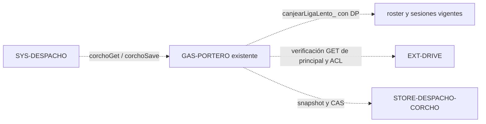

# Sala #35 · adaptador provisional de Corcho

Propuesta para revisión de Atlas bajo `CHG-DESPACHO-CHINCHES-001` y
`CTR-DESPACHO-CORCHO`. La fuente vive en `board-aurum`; el coordinador integrará
el adaptador en el backend Portero existente. Este trabajo no publica código,
no modifica el editor activo ni acredita el despliegue.

## Impacto propuesto

El atlas consultado es `yod-portal` en
`7843040d40e67679c3ea0b52bc09f5052d5cbbe8`, revisión
`2026-10-03.43-despacho-r2`. Su conexión
`CON-DESPACHO-CORCHO-STORE` todavía propone persistencia desde
`GAS-OPERACION`. Para este alojamiento provisional se propone registrar también
el recorrido siguiente, conservando el almacén independiente y el contrato:



Los componentes afectados son `SYS-DESPACHO`, `GAS-PORTERO`,
`STORE-DESPACHO-CORCHO` y `EXT-DRIVE`; la compatibilidad remota conserva
`SYS-TAREAS` y `GAS-OPERACION`. El roster y las sesiones de Portero son la
fuente de identidad; el libro privado es la fuente de notas y versión. El
guard comprueba principal efectivo, propietario único, ancestros y ACL con
metadatos frescos. No hay almacén alternativo ni creación de recursos.

La actualización del modelo y mapas centrales, y el cambio del commit de Atlas
fijado en el workflow, quedan para su revisión antes de integrar. El manifiesto
local conserva la revisión aprobada que usa ese workflow.

## Configuración e identidad

`corchoProperties_()` expone solo `CORCHO_OWNER_EMAIL` y
`CORCHO_SPREADSHEET_ID`. Para cada clave prefiere un valor de ScriptProperties;
solo si falta consulta `corchoDeploymentConfig_()` y solo si es una función.
No incluye valores predeterminados. Un error del servicio de propiedades o del
adaptador falla cerrado. El fallback privado es de configuración, nunca de
privacidad o almacenamiento.

`apps-script/corcho-deployment-config.gs.example` es una plantilla con
placeholders. **No desplegar esa plantilla**. Cualquier función de configuración
real se mantiene exclusivamente en la fuente privada del proyecto identificado
por el coordinador; no se incorporan IDs ni correos reales a este repositorio.

`corchoIdentity_(key)` usa `canjearLigaLento_(key, 'DP')` cuando existe. La
presencia y semántica de este helper en V57 provienen de la indicación del
coordinador; no se ha consultado producción. No invoca `canjearLiga_`,
`renuevaSesion_` ni cachés. Si solo existe el canje local que renueva sesiones,
rechaza el acceso; no recurre a HTTP. Cuando no hay Portero local mantiene el
canje remoto original mediante `PORTERO_EXEC`, con sus opciones y formato.

Ambos caminos exigen `ok === true`, correo exacto obtenido de `correo` y permiso
DP vigente, rol admin o `*`. El cliente no puede proporcionar su identidad ni
autorizarse con el payload. Un rechazo o excepción local no cae al remoto.
Cada llamada vuelve a verificar la identidad; `corchoGet` local no escribe
`SESIONES`, cachés ni notas. La compatibilidad remota conserva las posibles
semánticas de sesión del Portero remoto original.

## Inserción a cargo del coordinador

En el `Code` actual, inmediatamente después de parsear el JSON en `d` y antes
de `cfg` y de `esCredencialValida_`, insertar exactamente:

```javascript
if (d.action === 'corchoGet' || d.action === 'corchoSave') {
  return respuesta_(corchoHandle_(d));
}
```

La integración por AppsScriptAPI corresponde al coordinador después de Atlas.
El resto del despacho, `getAll`, `update`, credenciales TA, permisos y scopes se
conservan. `corchoPreflight_` continúa siendo privado, sin ruta pública y sin
lectura de notas. `corchoSave` sigue siendo una escritura explícita con lock,
CAS, guard antes de escribir y antes de devolver el ACK. Toda fila ocupada debe
tener la misma versión que `@config`; un snapshot mezclado se rechaza sin
exponerlo ni sobrescribirlo.

## Verificación y reversión

Pruebas aisladas: los 17 casos originales, compatibilidad HTTP remota,
prioridad local, sesión inválida/revocada, cambios de roster, propietario
exacto y DP/admin/`*`, ausencia o fallo de configuración, cero renovación o
escritura de sesiones/cachés en lectura local y versiones mezcladas. Todos los
datos, servicios y endpoints de prueba son sintéticos.

Ejecutar `node --test tests/*.test.mjs`, `npm ci`, `npm run build` y
`git diff --check`. El control del manifiesto contra el Atlas fijado acredita
estructura, no la aprobación del alojamiento provisional ni ejecución real.
Resultado local: **38/38 tests**, incluidos **31 de Corcho** (los 17 originales
y 14 nuevos) y 7 regresiones de encargos; instalación del lockfile, build,
`git diff --check` y validación estructural del impacto contra el Atlas fijado
correctos. No se modificó el lockfile ni se instalaron correcciones de dependencias.
La fuente activa, el despacho real, el principal, consentimiento y ACL siguen
siendo comprobaciones separadas a cargo del coordinador; no se accede a
secretos ni producción en esta entrega.

Revertir el commit restaura la fuente de Git. Si después se integra, el
coordinador restaura únicamente la fuente/versión previa respaldada, conservando
implementación, URL, configuración, permisos y filas. Nunca borrar o restaurar
datos de negocio como parte del rollback.
